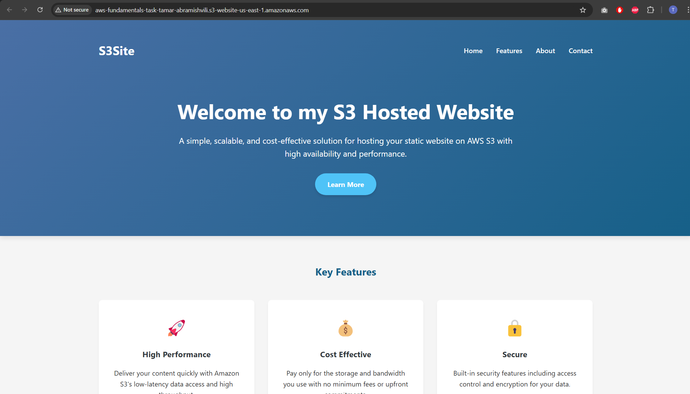

# AWS Static Website Deployment Guide

## Step 1: S3 Setup
  
*Description: Created bucket with static hosting enabled*

## Step 2: GitHub Actions Workflow
```yaml
name: Deploy to S3
on: [push]
jobs:
  deploy:
    steps:
      - uses: actions/checkout@v3
      - uses: aws-actions/configure-aws-credentials@v2
        with:
          aws-access-key-id: ${{ secrets.AWS_ACCESS_KEY_ID }}
          aws-secret-access-key: ${{ secrets.AWS_SECRET_ACCESS_KEY }}
          aws-region: us-east-1
      - run: aws s3 sync ./ s3://your-website-bucket --exclude ".git/*"
